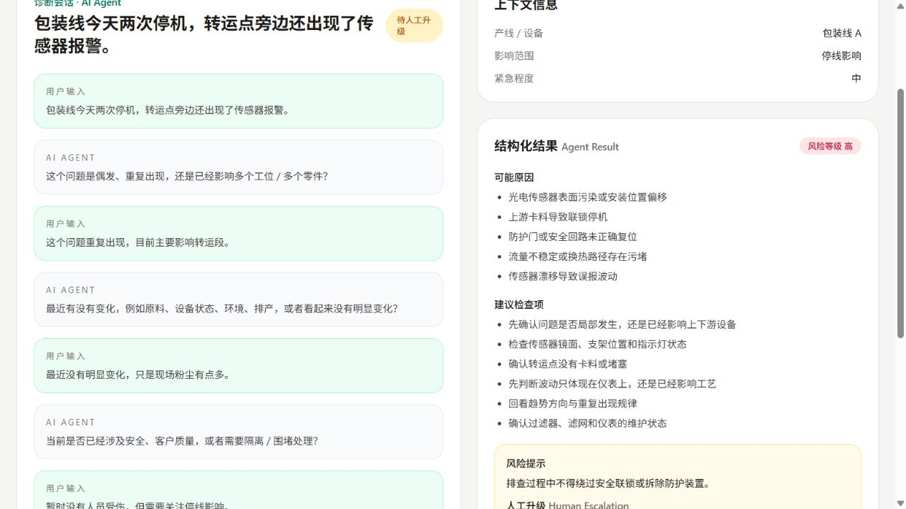

# manufacturing-troubleshooting-agent

制造现场问题助手公开 Demo，采用中文主界面 + 英文专业标签，展示一个可公开给 HR / 面试官查看的制造业问题处理 AI Agent 作品集项目。

Public reimplementation of a manufacturing troubleshooting AI Agent using synthetic data, designed as a simple and understandable portfolio demo for recruiters and interviewers.

> This repository is a public reimplementation using synthetic data.
> It contains no proprietary code, internal data, confidential materials, or company-specific assets.

## Demo Preview



## 项目定位 | Project Positioning

这个项目聚焦制造现场问题处理的最小闭环：

问题输入  
-> 信息不足时补充追问  
-> Knowledge Retrieval  
-> Risk Control / 风险判断  
-> 结构化处理建议  
-> Human-in-the-loop 人工升级  
-> 案例沉淀

The goal is not to replicate a production-grade system, but to show a safe, traceable, and easy-to-understand AI Agent workflow for manufacturing troubleshooting.

## V1 范围 | V1 Scope

- 问题输入界面
- 多轮追问
- Synthetic Data 知识库
- 简单关键词检索
- 风险规则
- 结构化 Agent Result
- 知识来源展示
- Risk Level
- Human Escalation
- 简单案例记录
- Good Case / Bad Case 测试样例

## 安全边界 | Safety Boundary

这个 Demo **不会**直接输出未经审核的高风险动作或定量调机参数。

当出现以下情况时，AI Agent 会明确进入人工审核 / 升级流程：

- 信息不足
- 知识覆盖不足
- 风险较高

This demo does **not** provide direct unreviewed high-risk actions or quantitative machine-setting instructions.

## 技术栈 | Tech Stack

- Python 3.11
- FastAPI
- SQLite
- Jinja2 templates
- Tailwind via CDN

## 快速启动 | Quick Start

```bash
python -m venv .venv
.venv\Scripts\activate
pip install -r requirements.txt
uvicorn app.main:app --reload
```

启动后打开 [http://127.0.0.1:8000](http://127.0.0.1:8000)。

Then open [http://127.0.0.1:8000](http://127.0.0.1:8000).

## 演示内容 | Demo Content

当前 Synthetic Data 示例包括：

- 虚构的制造现场问题知识条目
- 虚构的来源编号，如 `KB-OPS-001`
- 虚构案例，如输送线停机、涂装橘皮、冷水机波动、注塑短射、电机过载
- Good Case / Bad Case Evaluation 示例

不包含：

- 真实公司名称
- 内部文件或知识库
- 真实生产记录
- 私有仓库代码
- 专有工艺知识

## Repository Safety Statement

This repository is a public reimplementation using synthetic data.
It contains no proprietary code, internal data, confidential materials, or company-specific assets.
